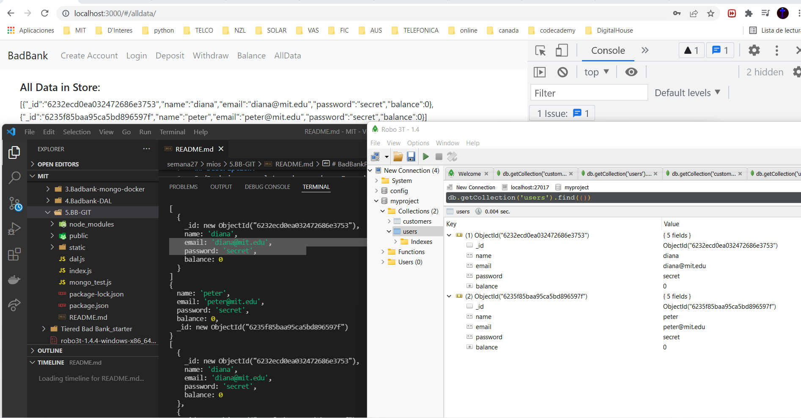

# BadBankProject
## Banking application 
 

# lucaza21.github.io/repository/

## Description: 
BadBank is a complete web app where I used a client, server, and database.
On the other hand, I used a Docker container for hosting my app.

## Usage: 
It helps to understand how to use JavaScript, HTML, CSS and BOOTSTRAP to create the front end. 
In the other hand we use express server, Docker, mongoDB and Robo3T for the backend.

# To Run 

## Mongo Setup
docker run -p 27017 --name badbank -d mongo
npm install mongodb

## node .\index.js
Running on port: 3000
Connected successfully to db server

## Support:
Email: <luis.carrasquilla.z@gmail.com> / 
Linkedin: **[Luis Carrasquilla](https://www.linkedin.com/in/luis-carrasquilla/)** 

## Roadmap
I'm planning to add more styles and transitions and a cool background effect to the pages.

## License information:  
This project has been made in the MIT xPRO's Professional Certificate in Coding: Full Stack Development with MERN